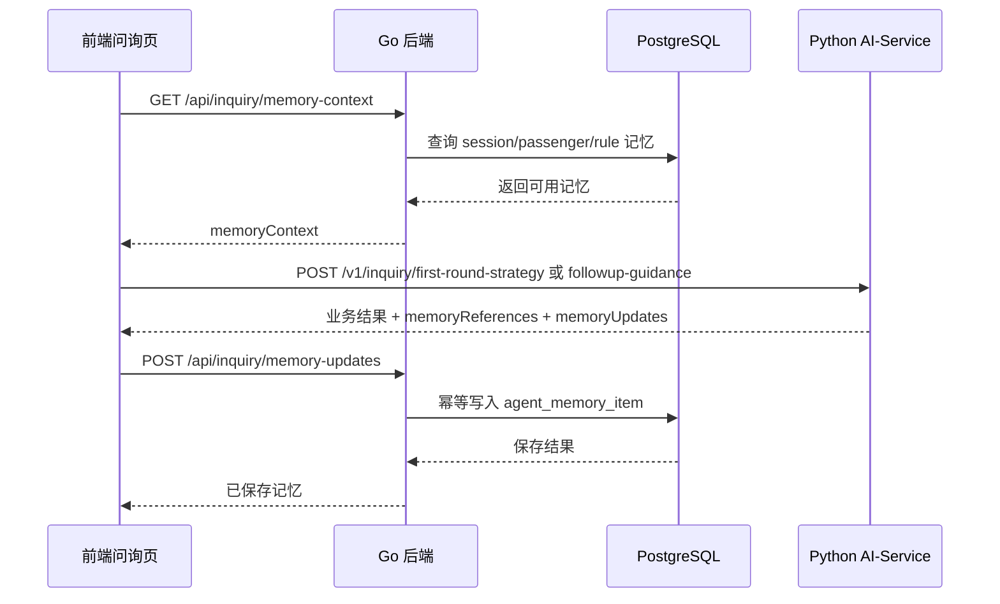

# 智能体记忆实现说明

本文档归档 IPRA 项目中“智能体记忆”能力的本次实现，用于说明它在智能旅客风险评估与辅助问询系统中的定位、数据流、接口契约、数据库落点和前端展示方式。

## 1. 能力定位

智能体记忆不是把全部聊天记录原样塞回模型，而是把问询过程中可复用、可审计、可过期的上下文沉淀为结构化记忆条目。当前实现把记忆定位为**辅助问询上下文增强**，用于帮助业务 LLM 在首轮策略和后续追问中复用既有事实、待核验缺口、历史线索和规则边界。

当前记忆分为三类：

| 类型 | scopeType | 说明 |
| --- | --- | --- |
| 会话记忆 | `session` | 绑定一次问询会话，记录本次问询内的策略、答复摘要、缺口和异常线索。 |
| 旅客记忆 | `passenger` | 绑定旅客标识，用于跨会话复用同一旅客的待核验方向和历史线索。 |
| 规则记忆 | `rule` | 绑定规则集，沉淀系统级规则，例如多模态线索只能作为追问参考。 |

业务约束：

- 记忆只能作为追问上下文和事实核验线索。
- 记忆不得单独构成风险结论。
- 多模态、动作和情绪线索不得单独构成风险结论。
- 普通问询接口只能写入 `session` 和 `passenger` 记忆，不能写入 `rule` 记忆。

## 2. 总体架构

智能体记忆由 Go 后端统一读写 PostgreSQL，Python AI-Service 不直连数据库。前端在调用 AI-Service 前从 Go 后端读取记忆上下文，AI-Service 根据上下文生成策略或追问后返回记忆引用和记忆更新，前端再把记忆更新提交给 Go 后端持久化。



## 3. 数据库落点

本次新增表：`agent_memory_item`。

核心字段：

| 字段 | 说明 |
| --- | --- |
| `scope_type` | 记忆作用域，取值为 `session`、`passenger`、`rule`。 |
| `scope_id` | 作用域标识，例如会话 ID、旅客 ID 或规则集 ID。 |
| `memory_type` | 记忆类型，取值为 `fact`、`gap`、`inconsistency`、`evidence`、`procedure`。 |
| `title` | 记忆标题，供前端轻量展示。 |
| `content` | 记忆正文。 |
| `evidence` | 记忆来源证据 JSON。 |
| `confidence` | 置信度，范围 `0-1`。 |
| `source` | 来源，例如 `ai-service`、`system-rule`。 |
| `status` | 状态，取值为 `active` 或 `inactive`。 |
| `content_hash` | 内容哈希，用于幂等去重。 |
| `expires_at` | 过期时间，规则记忆可为空。 |

默认过期策略：

| 作用域 | 默认过期 |
| --- | --- |
| `session` | 30 天 |
| `passenger` | 180 天 |
| `rule` | 不过期 |

建表命令：

```powershell
pnpm run db:schema:init
```

该命令复用后端配置加载逻辑，按当前 `.env` / `.env.local` / `.env.prod` 参数连接 PostgreSQL，并执行 `docs/database/schema.sql`。后端服务启动时不会自动建表。

## 4. 后端接口

### 4.1 查询记忆上下文

```http
GET /api/inquiry/memory-context?sessionId=...&passengerId=...
Authorization: Bearer <token>
```

响应示例：

```json
{
  "sessionId": "inq-20260511043330-vpyp10",
  "passengerId": "pax-e92834102",
  "sessionMemories": [],
  "passengerMemories": [],
  "ruleMemories": [
    {
      "scopeType": "rule",
      "scopeId": "default",
      "memoryType": "procedure",
      "title": "多模态线索使用边界",
      "content": "动作、情绪和多模态观察只能作为追问方向参考，不能单独构成风险结论。",
      "source": "system-rule"
    }
  ]
}
```

如果数据库中尚未写入规则记忆，后端会返回内置只读规则默认项，保证演示和联调链路可用。

### 4.2 写入记忆更新

```http
POST /api/inquiry/memory-updates
Authorization: Bearer <token>
Content-Type: application/json
```

请求示例：

```json
{
  "memoryUpdates": [
    {
      "scopeType": "session",
      "scopeId": "inq-20260511043330-vpyp10",
      "memoryType": "fact",
      "title": "首轮策略已生成",
      "content": "系统已根据画像、行程和既有记忆生成首轮问询策略。",
      "evidence": { "source": "ai-service" },
      "confidence": 0.72,
      "source": "ai-service"
    }
  ]
}
```

后端写入时会基于 `scopeType + scopeId + memoryType + content` 计算哈希。同一范围、同一类型、同一内容重复写入时，不新增重复行，而是更新证据、置信度、来源、状态和更新时间。

### 4.3 管理员停用记忆

```http
PATCH /api/admin/memories/:id/status
Authorization: Bearer <admin-token>
Content-Type: application/json
```

请求示例：

```json
{
  "status": "inactive"
}
```

该接口已实现，但当前前端管理页暂未接入。

## 5. AI-Service 接口扩展

首轮策略接口和后续追问接口都新增了记忆字段。

请求新增字段：

```json
{
  "memoryContext": {
    "sessionId": "...",
    "passengerId": "...",
    "sessionMemories": [],
    "passengerMemories": [],
    "ruleMemories": []
  }
}
```

响应新增字段：

```json
{
  "memoryReferences": [],
  "memoryUpdates": []
}
```

实现细节：

- 本地 Qwen2.5-3B 只负责生成核心业务字段，例如风险评估、问题清单、追问建议。
- `llm`、`memoryReferences`、`memoryUpdates` 由 AI-Service 服务端确定性补齐。
- 这样可以避免模型幻觉输出错误模型名，也减少 JSON 过长导致截断的概率。

当前支持的运行时模型配置仍来自 AI-Service 环境变量：

```text
BUSINESS_LLM_PROVIDER=transformers_local
BUSINESS_LLM_MODEL=Qwen2.5-3B-Instruct
BUSINESS_LLM_MODEL_PATH=../../models/business-llm/modelscope/Qwen2.5-3B-Instruct
```

## 6. 前端展示与交互

前端问询页新增“智能体记忆”轻量面板，展示：

- 会话记忆
- 旅客记忆
- 规则记忆
- 记忆来源
- 置信度
- 更新时间

问询流程中的记忆交互：

1. 首轮策略生成前，前端读取 `memoryContext`。
2. 前端把 `memoryContext` 随首轮策略请求传给 AI-Service。
3. AI-Service 返回首轮策略、记忆引用和记忆更新。
4. 前端调用后端保存 `memoryUpdates`。
5. 进入下一轮或人工判断前，前端再次刷新记忆上下文。

如果记忆读取或保存失败，前端不会阻断问询流程，只会显示轻量提示。

未接入 ASR 时，如果当前轮次没有答复文本，系统会沉淀状态提示：

```text
当前未接入 ASR，答复摘要将在接入实时转写或人工记录后生成。
```

该提示用于说明能力状态，不代表问询异常。

## 7. 关键文件

| 文件 | 说明 |
| --- | --- |
| `apps/backend/internal/memory/` | Go 后端记忆仓储和接口实现。 |
| `apps/backend/internal/database/models.go` | `AgentMemoryItem` GORM model。 |
| `apps/backend/cmd/dbschema-init/main.go` | 显式 schema 初始化命令入口。 |
| `docs/database/schema.sql` | 活动数据库 schema，包含 `agent_memory_item`。 |
| `apps/ai-service/app/schemas/inquiry.py` | AI-Service 记忆请求/响应 schema。 |
| `apps/ai-service/app/services/memory_utils.py` | 记忆引用和记忆更新生成逻辑。 |
| `apps/frontend/src/app/memory-service.ts` | 前端调用 Go 后端记忆接口。 |
| `apps/frontend/src/views/UserAskView.vue` | 问询页记忆面板和流程接入。 |

## 8. 验证命令

数据库初始化：

```powershell
pnpm run db:schema:init
```

后端测试：

```powershell
cd apps/backend
go test ./...
```

前端验证：

```powershell
pnpm run typecheck:frontend
pnpm run test:frontend
pnpm run build:frontend
```

AI-Service mock smoke test：

```powershell
$env:BUSINESS_LLM_PROVIDER="mock"
& ".\apps\ai-service\.venv\Scripts\python.exe" apps\ai-service\scripts\smoke_first_round_strategy.py
& ".\apps\ai-service\.venv\Scripts\python.exe" apps\ai-service\scripts\smoke_followup_guidance.py
```

启动 AI-Service：

```powershell
& ".\apps\ai-service\.venv\Scripts\python.exe" -m uvicorn service:app --app-dir apps\ai-service\app --host 127.0.0.1 --port 9000
```