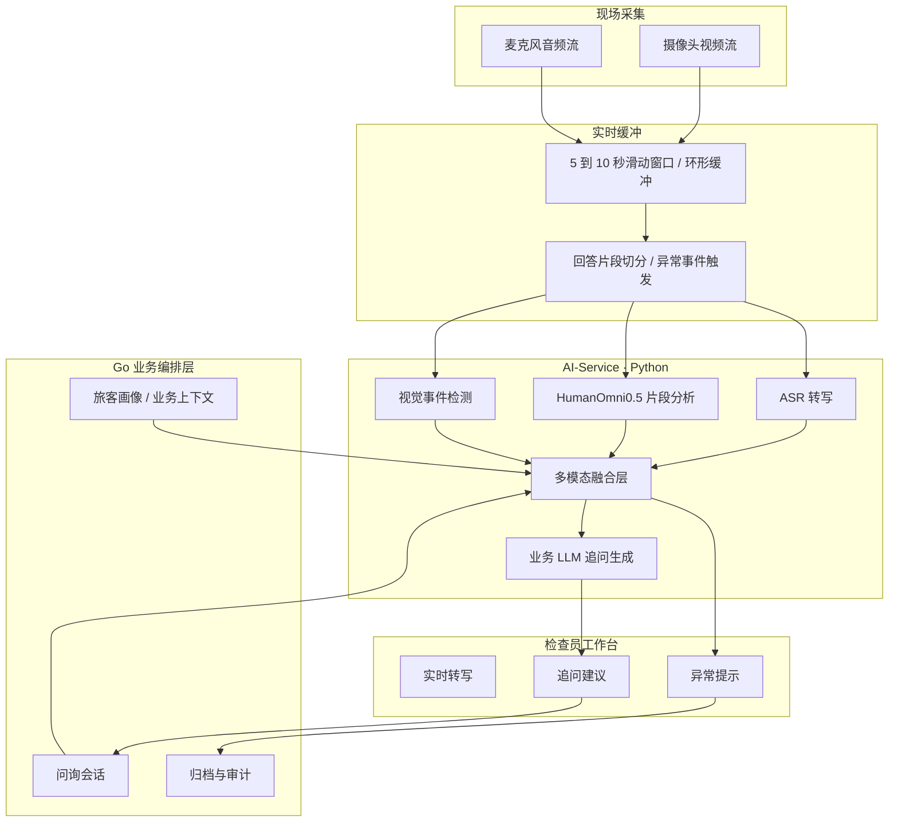

# AI-Service 架构说明和示例说明

本文档用于归档 D.LLM 模块当前阶段的技术判断与实现口径，重点说明 AI-Service 在“智能旅客风险评估与辅助问询系统”中的职责、HumanOmni0.5 的使用方式、实时音视频窗口的处理流程，以及后续多模态情感分析与追问生成的输入输出示例。

## 1. 文档定位

AI-Service 是本项目中面向 AI 能力的 Python 服务层，当前优先承担 HumanOmni0.5 推理验证、5 到 10 秒音视频片段分析、结构化观察结果生成、以及后续与 ASR 和业务 LLM 对接的职责。

当前已经完成的基础工作包括：

- HumanOmni0.5 模型已放置在 `models/humanomni0.5/iic/HumanOmni-0___5B`。
- 官方 HumanOmni 代码已归档在 `apps/ai-service/vendor/HumanOmni-official/HumanOmni-main`。
- AI-Service 基础目录已建立在 `apps/ai-service`。
- 已跑通 `video` 和 `video_audio` 两类 HumanOmni inference。
- 带 `_ad.mp4` 后缀的测试视频表示视频中包含音频轨，应使用 `--modal video_audio` 测试。

本文描述的是 D.LLM 模块的目标实现方式，不表示当前仓库已经完成所有实时采集、ASR、融合判断和前端联动能力。

## 2. 核心结论

HumanOmni0.5 更适合作为多模态观察模型，用于分析最近 5 到 10 秒音视频片段中的可见行为、表情变化、语音相关线索和整体状态摘要。

项目最终需要的“多模态情感分析结果”和“辅助追问建议”，应由融合层和业务 LLM 共同完成：

- HumanOmni 负责输出音视频片段的多模态观察摘要。
- ASR 负责连续转写旅客回答内容，并提供回答文本与时间戳。
- 视觉事件检测模块负责补充更细粒度的动作、视线、姿态和微表情事件。
- 多模态融合层负责把 ASR 文本、HumanOmni 摘要、视觉事件、问询上下文和旅客画像合并成结构化判断。
- 业务 LLM 负责根据结构化判断、规则约束和当前问询目标生成下一轮追问建议。
- 检查员负责最终确认、采纳、修改或拒绝系统建议。

## 3. AI-Service 目标架构

AI-Service 在目标系统中位于 Python AI 能力层，对上接受 Go 后端或前端工作站发来的分析请求，对下调用模型、ASR、视觉算法和本地缓存。



## 4. 实时处理流程

目标运行方式不是先录完整视频再分析，而是在问询现场持续维护最近 5 到 10 秒的音视频窗口。

推荐流程如下：

1. 摄像头和麦克风持续采集音视频流。
2. AI-Service 或采集端维护一个环形缓冲区，始终保存最近 5 到 10 秒数据。
3. 当检测到旅客回答结束、语音停顿、敏感关键词、明显动作变化或检查员手动触发时，从缓冲区截取对应片段。
4. 对片段调用 ASR 获取回答文本和时间戳。
5. 对同一片段调用 HumanOmni 生成多模态摘要。
6. 对同一片段调用视觉事件检测，提取视线变化、低头、摇头、皱眉、手部遮挡、坐姿变化等事件。
7. 融合层把 ASR、HumanOmni、视觉事件和业务上下文合并成结构化情感和异常分析结果。
8. 业务 LLM 基于融合结果和问询目标生成下一轮追问建议。
9. 前端展示异常提示、证据时间点、追问建议和检查员操作入口。

## 5. 目录结构

当前 AI-Service 目录建议继续按以下方式维护：

```text
apps/ai-service/
  app/
    check_env.py              # 环境、模型、CUDA、依赖检查
    download_deps.py          # 下载 SigLIP、Whisper、BERT 等依赖模型
    infer_once.py             # 单个音视频文件 HumanOmni 推理
    run_sample_tests.py       # 批量测试 samples 中的视频
    service.py                # FastAPI 服务骨架
    compat/
      decord/                 # Windows 下的 decord 兼容层
  samples/                    # 测试视频和说明
  test-runs/                  # 批量测试输出结果
  vendor/
    HumanOmni-official/       # 官方 HumanOmni 源码归档
  .env.example
  requirements.txt
  README.md
```

模型和依赖缓存建议统一放在仓库根目录的 `models` 下：

```text
models/
  humanomni0.5/
    iic/
      HumanOmni-0___5B/
    huggingface/
      hub/
```

## 6. 测试视频命名规则

测试视频建议使用统一命名，便于批量测试和归档：

```text
humanomni_test_<序号>_<场景说明>_video.mp4
humanomni_test_<序号>_<场景说明>_video_ad.mp4
```

命名含义如下：

| 字段 | 含义 |
| --- | --- |
| `humanomni_test` | HumanOmni 测试样本前缀 |
| `<序号>` | 两位数字编号，例如 `01`、`02` |
| `<场景说明>` | 简短英文场景名，例如 `funding_stress`、`gaze_avoidance` |
| `_video` | 普通视频样本 |
| `_video_ad` | 带 audio 的视频样本，应使用 `video_audio` 模式 |

示例：

```text
humanomni_test_01_baseline_video.mp4
humanomni_test_02_funding_stress_video_ad.mp4
humanomni_test_03_gaze_avoidance_video.mp4
humanomni_test_04_micro_expression_video.mp4
humanomni_test_06_followup_context_video_ad.mp4
```

根据项目真实场景，问询通常存在语音环境，因此后续重点测试对象应优先选择 `_ad.mp4` 样本。

## 7. HumanOmni 推理测试命令

### 7.1 环境检查

在仓库根目录执行：

```powershell
cd D:\405project\ipra
& "D:\405project\ipra\apps\ai-service\.venv\Scripts\python.exe" apps\ai-service\app\check_env.py
```

### 7.2 单个带音频视频测试

```powershell
cd D:\405project\ipra
$env:HF_HOME="D:\405project\ipra\models\humanomni0.5\huggingface"
$env:TRANSFORMERS_CACHE="D:\405project\ipra\models\humanomni0.5\huggingface\hub"
$env:TRANSFORMERS_OFFLINE="1"

& "D:\405project\ipra\apps\ai-service\.venv\Scripts\python.exe" apps\ai-service\app\infer_once.py `
  --modal video_audio `
  --video-path apps\ai-service\samples\humanomni_test_02_funding_stress_video_ad.mp4 `
  --instruct "Describe the person in the video. What is the person saying, and what visible emotional changes can you observe?" `
  --max-new-tokens 128
```

### 7.3 批量测试所有带音频样本

```powershell
cd D:\405project\ipra
$env:HF_HOME="D:\405project\ipra\models\humanomni0.5\huggingface"
$env:TRANSFORMERS_CACHE="D:\405project\ipra\models\humanomni0.5\huggingface\hub"
$env:TRANSFORMERS_OFFLINE="1"

& "D:\405project\ipra\apps\ai-service\.venv\Scripts\python.exe" apps\ai-service\app\run_sample_tests.py `
  --pattern "*_ad.mp4" `
  --modal video_audio `
  --max-new-tokens 128
```

批量测试结果会输出到：

```text
apps/ai-service/test-runs/
```

## 8. 多模态融合输出示例

HumanOmni 的原始输出可以作为 `humanOmniSummary` 保存，ASR 的结果作为 `asrText` 保存，视觉算法输出作为 `visualEvents` 保存。融合层再生成面向业务的 `fusionSummary`、`riskHints` 和 `followupFocus`。

```json
{
  "sessionId": "inq-20260502-001",
  "passengerId": "pax-001",
  "questionId": "q-funding-source",
  "windowStart": "00:01:20.000",
  "windowEnd": "00:01:30.000",
  "trigger": {
    "type": "answer_segment_end",
    "description": "旅客回答资金来源问题后出现短暂停顿"
  },
  "asrText": "这次费用主要是朋友帮我垫付的。",
  "keywords": ["费用", "朋友", "垫付"],
  "humanOmniSummary": "The person is speaking with hands clasped. Visible emotional changes include frown and head movement.",
  "visualEvents": [
    {
      "type": "gaze_avoidance",
      "time": "00:01:24.200",
      "confidence": 0.78,
      "description": "提到费用来源后视线短暂向下偏移"
    },
    {
      "type": "micro_expression",
      "time": "00:01:25.100",
      "confidence": 0.66,
      "description": "出现轻微皱眉"
    },
    {
      "type": "head_movement",
      "time": "00:01:26.000",
      "confidence": 0.71,
      "description": "回答后出现轻微摇头动作"
    }
  ],
  "fusionSummary": "旅客在说明费用来源时出现视线回避、轻微皱眉和摇头动作。该片段不能单独构成风险结论，但建议结合资金来源、同行关系和购票记录继续核验。",
  "emotionState": {
    "label": "nervous_or_uncertain",
    "confidence": 0.64,
    "evidence": [
      "回答涉及资金来源",
      "出现视线下移",
      "出现皱眉和轻微摇头"
    ]
  },
  "riskHints": [
    "资金来源表述需要与旅客收入、同行关系、购票记录交叉核验",
    "建议确认垫付人身份、关系和付款方式"
  ],
  "followupFocus": [
    "资金来源",
    "垫付人身份",
    "付款凭证"
  ]
}
```

## 9. 业务 LLM 追问生成示例

业务 LLM 的输入不应只给 HumanOmni 原文，而应给融合后的结构化结果、当前问询问题、旅客回答、旅客画像和可用规则。

### 9.1 输入示例

```json
{
  "role": "assistant_question_generator",
  "task": "根据当前回答和多模态观察生成下一轮问询建议",
  "currentQuestion": "请说明本次行程费用来源。",
  "passengerAnswer": "这次费用主要是朋友帮我垫付的。",
  "profileContext": {
    "declaredOccupation": "自由职业",
    "declaredMonthlyIncome": "不稳定",
    "tripDestination": "境外短期停留",
    "knownCompanions": []
  },
  "multimodalAnalysis": {
    "fusionSummary": "旅客在说明费用来源时出现视线回避、轻微皱眉和摇头动作。",
    "emotionState": "nervous_or_uncertain",
    "riskHints": [
      "资金来源表述需要与旅客收入、同行关系、购票记录交叉核验",
      "建议确认垫付人身份、关系和付款方式"
    ]
  },
  "constraints": [
    "问题必须简短、明确、中性",
    "不得直接指控旅客",
    "每次只问一个核心点",
    "输出 2 到 3 个可选追问"
  ]
}
```

### 9.2 输出示例

```json
{
  "suggestedQuestions": [
    {
      "priority": 1,
      "question": "这位帮您垫付费用的朋友叫什么名字，和您是什么关系？",
      "reason": "核验垫付人身份和关系，确认资金来源解释是否完整。"
    },
    {
      "priority": 2,
      "question": "这笔费用是通过什么方式支付的，是否方便说明付款时间？",
      "reason": "核验付款方式和时间，与购票或行程记录交叉验证。"
    },
    {
      "priority": 3,
      "question": "这次行程中还有其他费用是由这位朋友承担的吗？",
      "reason": "确认垫付范围，判断是否存在未说明的资助关系。"
    }
  ],
  "operatorNote": "建议检查员优先核验资金来源，不应仅依据表情或动作作出风险结论。"
}
```

## 10. AI-Service 对外接口建议

后续将 `app/service.py` 完善为 FastAPI 服务时，建议先实现以下接口。

### 10.1 片段分析接口

```http
POST /v1/analyze-segment
```

请求示例：

```json
{
  "sessionId": "inq-20260502-001",
  "questionId": "q-funding-source",
  "segmentPath": "apps/ai-service/samples/humanomni_test_02_funding_stress_video_ad.mp4",
  "modal": "video_audio",
  "windowStart": "00:01:20.000",
  "windowEnd": "00:01:30.000",
  "instruction": "Describe the person's speech, visible emotion, gaze, head movement and unusual behavior in this segment."
}
```

响应示例：

```json
{
  "sessionId": "inq-20260502-001",
  "questionId": "q-funding-source",
  "windowStart": "00:01:20.000",
  "windowEnd": "00:01:30.000",
  "modal": "video_audio",
  "humanOmniSummary": "The person is speaking with hands clasped. Visible emotional changes include frown and head movement.",
  "model": {
    "name": "HumanOmni0.5",
    "status": "ok"
  }
}
```

### 10.2 融合分析接口

```http
POST /v1/fuse-observations
```

请求示例：

```json
{
  "sessionId": "inq-20260502-001",
  "questionId": "q-funding-source",
  "asrText": "这次费用主要是朋友帮我垫付的。",
  "humanOmniSummary": "The person is speaking with hands clasped. Visible emotional changes include frown and head movement.",
  "visualEvents": [
    {
      "type": "gaze_avoidance",
      "time": "00:01:24.200",
      "confidence": 0.78,
      "description": "提到费用来源后视线短暂向下偏移"
    }
  ],
  "businessContext": {
    "currentTopic": "funding_source",
    "declaredOccupation": "自由职业",
    "declaredMonthlyIncome": "不稳定"
  }
}
```

响应示例：

```json
{
  "fusionSummary": "旅客在说明费用来源时出现视线回避。建议结合资金来源、同行关系和付款记录继续核验。",
  "emotionState": {
    "label": "nervous_or_uncertain",
    "confidence": 0.58
  },
  "riskHints": [
    "资金来源需要补充说明",
    "建议核验垫付人身份与付款方式"
  ],
  "followupFocus": [
    "垫付人身份",
    "付款方式"
  ]
}
```
