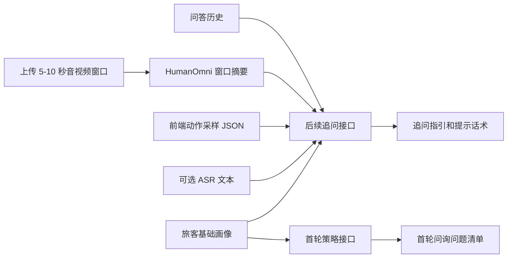

# AI-Service 架构说明和示例说明

本文档归档 D.LLM 模块当前阶段的实现方式。当前主线不再使用 MediaPipe，也不要求 HumanOmni 输出结构化动作识别。AI-Service 负责提供两个业务 LLM 接口：首轮问询策略生成、后续追问指引生成。

## 1. 职责边界

当前 D.LLM 模块按以下边界实现：

- HumanOmni0.5：只负责对音视频窗口生成摘要，例如旅客是否在说话、整体状态和可见表现。
- 前端或动作识别模块：负责输出动作、微表情、视线、手部动作等结构化 JSON。
- ASR：由其他同学负责，AI-Service 只保留可选字段，便于后续合并语音文本。
- 业务 LLM：负责结合旅客画像、问答历史、HumanOmni 摘要和动作 JSON，生成问询策略和追问话术。
- 工作人员：负责最终确认、采纳、修改或忽略系统建议。



## 2. 对外接口

### 2.1 HumanOmni 窗口摘要

```http
POST /v1/humanomni/summarize-window
Content-Type: multipart/form-data
```

该接口用于后续轮次分析。前端上传已经截取好的回答片段，AI-Service 保存文件后同步调用 HumanOmni，返回窗口摘要。该接口不识别动作、微表情、视线和手部动作，这些结构化数据由前端或其他模块生成后传入后续追问接口。建议前端上传已经转码好的标准 `mp4/h264/aac` 片段，避免浏览器原始 `webm` 因缺少有效时长索引导致 HumanOmni 读取不到帧数。

表单字段：

| 字段 | 必填 | 说明 |
| --- | --- | --- |
| `file` | 是 | 上传的视频或音频片段，建议 mp4 |
| `sessionId` | 是 | 问询会话 ID |
| `questionId` | 否 | 当前问题 ID |
| `windowId` | 否 | 窗口 ID，不传则服务端生成 |
| `modal` | 否 | `video`、`video_audio` 或 `audio`，默认 `video_audio` |
| `startSeconds` | 否 | 原始问询时间线中的窗口开始秒数 |
| `endSeconds` | 否 | 原始问询时间线中的窗口结束秒数 |
| `maxNewTokens` | 否 | HumanOmni 最大输出 token，默认 128 |
| `numFrames` | 否 | HumanOmni 视频采样帧数，不传则使用模型默认 |
| `instruct` | 否 | HumanOmni 摘要提示词 |

响应示例：

```json
{
  "ok": true,
  "sessionId": "inq-001",
  "questionId": "q1",
  "windowId": "w1",
  "startSeconds": 18.0,
  "endSeconds": 23.0,
  "modal": "video_audio",
  "uploadedFile": {
    "filename": "answer-window.mp4",
    "storedPath": "D:/405project/ipra/apps/ai-service/uploads/humanomni-windows/inq-001-w1.mp4",
    "contentType": "video/mp4",
    "sizeBytes": 1024000
  },
  "humanOmni": {
    "modelName": "HumanOmni0.5",
    "rawSummary": "The person is speaking and appears slightly tense.",
    "elapsedSeconds": 42.5,
    "error": null
  },
  "humanOmniWindow": {
    "windowId": "w1",
    "questionId": "q1",
    "startSeconds": 18.0,
    "endSeconds": 23.0,
    "modal": "video_audio",
    "rawSummary": "The person is speaking and appears slightly tense.",
    "modelName": "HumanOmni0.5"
  }
}
```

### 2.2 首轮问询策略生成

```http
POST /v1/inquiry/first-round-strategy
```

请求示例：

```json
{
  "sessionId": "inq-001",
  "passengerProfile": {
    "passengerId": "pax-001",
    "name": "张三",
    "age": 28,
    "nationality": "中国",
    "occupation": "自由职业",
    "monthlyIncome": "不稳定"
  },
  "tripProfile": {
    "destination": "境外短期停留地",
    "purposeDeclared": "旅游",
    "stayDays": 21,
    "ticketType": "单程",
    "companions": []
  },
  "knownFacts": [
    "旅客无法提供稳定收入证明",
    "行程停留时间较长"
  ],
  "constraints": {
    "questionCount": 6,
    "tone": "中性、专业、非指控",
    "language": "zh-CN"
  }
}
```

响应核心字段：

```json
{
  "sessionId": "inq-001",
  "llm": {
    "provider": "mock",
    "model": "mock-business-llm"
  },
  "riskAssessment": {
    "level": "medium",
    "summary": "基础画像中存在需要进一步核验的要素。",
    "reasons": []
  },
  "strategy": {
    "goal": "初步试探旅客真实出境目的。",
    "focusAreas": ["出境目的", "行程安排", "资金来源", "返程计划"]
  },
  "questions": [],
  "operatorNote": "本轮建议以开放式、事实核验型问题为主。"
}
```

### 2.3 后续追问指引生成

```http
POST /v1/inquiry/followup-guidance
```

请求示例：

```json
{
  "sessionId": "inq-001",
  "roundNo": 2,
  "passengerProfile": {
    "passengerId": "pax-001",
    "name": "张三",
    "occupation": "自由职业",
    "monthlyIncome": "不稳定"
  },
  "tripProfile": {
    "destination": "境外短期停留地",
    "purposeDeclared": "旅游",
    "stayDays": 21
  },
  "qaHistory": [
    {
      "questionId": "q1",
      "roundNo": 1,
      "question": "请您说明这次出境的主要目的。",
      "answerText": "我是去旅游，可能住二十多天，具体还要看朋友那边安排。",
      "answerStartSeconds": 12.4,
      "answerEndSeconds": 25.8
    }
  ],
  "humanOmniWindows": [
    {
      "windowId": "w1",
      "questionId": "q1",
      "startSeconds": 18.0,
      "endSeconds": 23.0,
      "modal": "video_audio",
      "rawSummary": "The person speaks with hesitation and shows a tense facial expression.",
      "modelName": "HumanOmni0.5"
    }
  ],
  "actionObservations": [
    {
      "observationId": "obs1",
      "type": "gaze_shift",
      "label": "视线偏移",
      "description": "回答停留时间时出现短暂视线偏移",
      "startSeconds": 18.0,
      "endSeconds": 20.5,
      "confidence": 0.68,
      "source": "frontend"
    }
  ],
  "asr": {
    "status": "not_connected",
    "text": "",
    "segments": [],
    "words": []
  },
  "constraints": {
    "questionCount": 3,
    "tone": "中性、专业、非指控",
    "language": "zh-CN"
  }
}
```

响应核心字段：

```json
{
  "sessionId": "inq-001",
  "roundNo": 2,
  "multimodalAssessment": {
    "summary": "已结合问答历史、HumanOmni 摘要和外部动作采样形成后续追问参考。",
    "riskHints": [],
    "evidence": [],
    "limitations": []
  },
  "followupGuidance": [
    {
      "priority": 1,
      "question": "请您进一步说明这次出境的具体行程安排，包括主要地点和时间顺序。",
      "reason": "补充行程细节，核验申报目的与实际安排是否一致。",
      "operatorTip": "保持中性核验，鼓励旅客按时间顺序说明。",
      "focusArea": "行程细节"
    },
    {
      "priority": 2,
      "question": "请问这次行程费用的具体来源和支付方式是什么？",
      "reason": "核验资金来源、支付方式与旅客基础画像是否匹配。",
      "operatorTip": "围绕事实核验，不直接质疑资金真实性。",
      "focusArea": "资金来源"
    },
    {
      "priority": 3,
      "question": "您到达后住宿和联系人是否已经确定，是否方便说明具体安排？",
      "reason": "核验住宿安排、境外联系人和停留计划是否清晰。",
      "operatorTip": "如旅客回答不确定，可继续追问预订凭证或联系人关系。",
      "focusArea": "住宿与联系人"
    }
  ],
  "operatorNote": "建议优先围绕画像与答复中缺失或不一致的事实点继续追问。",
  "warnings": [
    "多模态观察结果不单独构成风险结论。"
  ]
}
```

## 3. 本地运行和测试

安装依赖：

```powershell
cd D:\405project\ipra
py -3.12 -m venv apps\ai-service\.venv
& ".\apps\ai-service\.venv\Scripts\python.exe" -m pip install --upgrade pip
& ".\apps\ai-service\.venv\Scripts\python.exe" -m pip install --proxy http://127.0.0.1:7897 -r apps\ai-service\requirements.txt
```

启动服务：

```powershell
& ".\apps\ai-service\.venv\Scripts\python.exe" -m uvicorn service:app --app-dir apps\ai-service\app --host 127.0.0.1 --port 9000
```

首轮策略 smoke test：

```powershell
& ".\apps\ai-service\.venv\Scripts\python.exe" apps\ai-service\scripts\smoke_first_round_strategy.py
```

后续追问 smoke test：

```powershell
& ".\apps\ai-service\.venv\Scripts\python.exe" apps\ai-service\scripts\smoke_followup_guidance.py
```

HumanOmni 上传摘要 smoke test 需要先启动服务：

```powershell
& ".\apps\ai-service\.venv\Scripts\python.exe" apps\ai-service\scripts\smoke_humanomni_summarize_window.py --base-url http://127.0.0.1:9000
```

如果服务已经启动，可以加 `--base-url` 走真实 HTTP：

```powershell
& ".\apps\ai-service\.venv\Scripts\python.exe" apps\ai-service\scripts\smoke_first_round_strategy.py --base-url http://127.0.0.1:9000
& ".\apps\ai-service\.venv\Scripts\python.exe" apps\ai-service\scripts\smoke_followup_guidance.py --base-url http://127.0.0.1:9000
```

## 4. 历史脚本说明

`mediapipe_analyze_once.py`、`analyze_window_once.py` 和 `video_observation.py` 保留为历史调试材料，当前主流程不再依赖 MediaPipe。后续如果需要重新启用视觉算法，应作为独立动作识别模块输出 `actionObservations` JSON，再传入后续追问接口。
