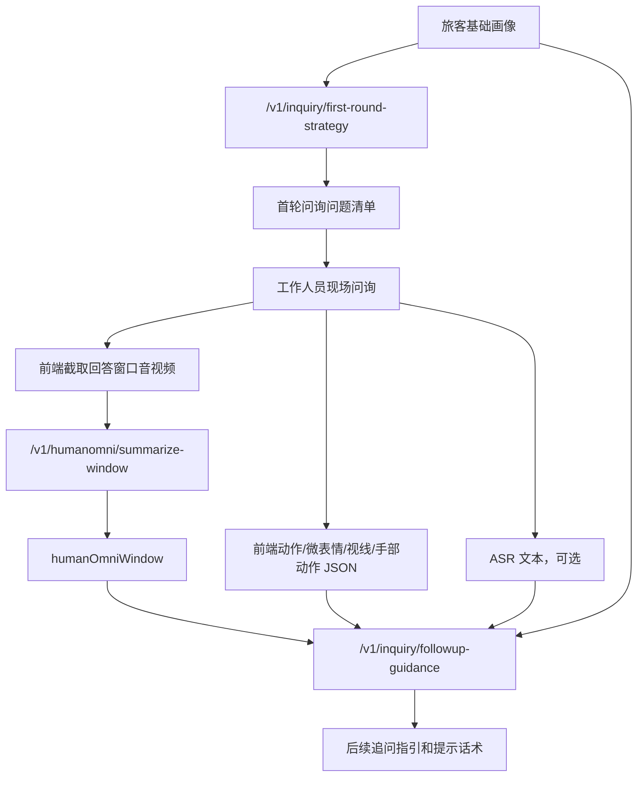

# AI-Service 接口对接文档

本文档用于前端、后端和 AI-Service 联调。当前 AI-Service 提供三个主要接口：

| 场景 | 接口 | 说明 |
| --- | --- | --- |
| HumanOmni 视频摘要 | `POST /v1/humanomni/summarize-window` | 上传 5-10 秒音视频片段，返回 HumanOmni 窗口摘要 |
| 首轮问询策略 | `POST /v1/inquiry/first-round-strategy` | 根据旅客基础画像生成首轮问题清单 |
| 后续追问指引 | `POST /v1/inquiry/followup-guidance` | 接收画像、问答历史、HumanOmni 摘要、动作 JSON 和可选 ASR 文本，生成追问建议 |

## 1. 推荐对接流程



说明：

- HumanOmni 只负责窗口级音视频摘要，不负责结构化动作识别。
- 动作、微表情、视线、手部动作等结构化数据由前端或独立动作识别模块生成，传入 `actionObservations`。
- ASR 当前不是 D.LLM 负责范围，但后续追问接口已经保留 `asr` 字段；未接入时可以不传，或传 `status: "not_connected"`。

## 2. HumanOmni 视频摘要接口

```http
POST /v1/humanomni/summarize-window
Content-Type: multipart/form-data
```

用途：上传某一轮回答对应的 5-10 秒音视频片段，由 AI-Service 调用 HumanOmni0.5 生成摘要。建议前端上传已经转码好的标准 `mp4/h264/aac` 片段，避免浏览器原始 `webm` 因缺少有效时长索引导致 HumanOmni 读取不到帧数。

### 2.1 表单字段

| 字段 | 类型 | 必填 | 说明 |
| --- | --- | --- | --- |
| `file` | file | 是 | 上传的视频或音频片段，当前前端按 MP4/H.264 生成并上传 |
| `sessionId` | string | 是 | 问询会话 ID |
| `questionId` | string | 否 | 当前问题 ID |
| `windowId` | string | 否 | 当前窗口 ID，不传则服务端生成 |
| `modal` | string | 否 | `video`、`video_audio` 或 `audio`，默认 `video_audio` |
| `startSeconds` | number | 否 | 该窗口在原始问询时间线中的开始秒数 |
| `endSeconds` | number | 否 | 该窗口在原始问询时间线中的结束秒数 |
| `maxNewTokens` | number | 否 | HumanOmni 最大输出 token，默认 128 |
| `numFrames` | number | 否 | HumanOmni 视频采样帧数，不传则使用模型默认 |
| `instruct` | string | 否 | HumanOmni 摘要提示词，不传则使用默认摘要提示词 |

### 2.2 响应示例

```json
{
  "ok": true,
  "sessionId": "inq-001",
  "questionId": "q1",
  "windowId": "w1",
  "startSeconds": 18.0,
  "endSeconds": 23.0,
  "modal": "video_audio",
  "uploadedFile": {
    "filename": "answer-window.mp4",
    "storedPath": "D:/405project/ipra/apps/ai-service/uploads/humanomni-windows/inq-001-w1.mp4",
    "contentType": "video/mp4",
    "sizeBytes": 1024000
  },
  "humanOmni": {
    "modelName": "HumanOmni0.5",
    "rawSummary": "The person is speaking and appears slightly tense.",
    "elapsedSeconds": 13.5,
    "error": null
  },
  "humanOmniWindow": {
    "windowId": "w1",
    "questionId": "q1",
    "startSeconds": 18.0,
    "endSeconds": 23.0,
    "modal": "video_audio",
    "rawSummary": "The person is speaking and appears slightly tense.",
    "modelName": "HumanOmni0.5"
  }
}
```

`humanOmniWindow` 可以直接放入后续追问接口的 `humanOmniWindows` 数组中。

## 3. 首轮问询策略接口

```http
POST /v1/inquiry/first-round-strategy
Content-Type: application/json
```

用途：根据旅客基础画像和行程信息，生成首轮问询问题清单。

### 3.1 请求示例

```json
{
  "sessionId": "inq-001",
  "passengerProfile": {
    "passengerId": "pax-001",
    "name": "张三",
    "age": 28,
    "nationality": "中国",
    "occupation": "自由职业",
    "monthlyIncome": "不稳定"
  },
  "tripProfile": {
    "destination": "境外短期停留地",
    "purposeDeclared": "旅游",
    "stayDays": 21,
    "ticketType": "单程",
    "companions": [],
    "fundingSource": "本人承担"
  },
  "knownFacts": [
    "旅客无法提供稳定收入证明",
    "行程停留时间较长"
  ],
  "constraints": {
    "questionCount": 6,
    "tone": "中性、专业、非指控",
    "language": "zh-CN"
  }
}
```

### 3.2 响应核心字段

| 字段 | 说明 |
| --- | --- |
| `riskAssessment` | 首轮预评估摘要、风险等级和原因 |
| `strategy` | 首轮问询目标和关注方向 |
| `questions` | 问题清单，每个问题包含提问目的和预期核验信息 |
| `operatorNote` | 给工作人员的提示 |

## 4. 后续追问指引接口

```http
POST /v1/inquiry/followup-guidance
Content-Type: application/json
```

用途：接收多轮问答历史、HumanOmni 窗口摘要、前端动作 JSON 和可选 ASR 文本，生成后续追问指引和提示话术。

### 4.1 是否保留 ASR 字段

**保留了。** 当前接口中的 `asr` 字段是可选字段：

- ASR 未接入时：可以不传 `asr`，或传 `{"status": "not_connected", "text": ""}`。
- ASR 接入后：把同一回答窗口或同一轮回答的转写文本、分段和词级时间戳写入 `asr`。
- 业务 LLM 后续会把 `asr.text`、`humanOmniWindows` 和 `actionObservations` 一起作为追问判断输入。

注意：视频上传接口 `/v1/humanomni/summarize-window` 不接收 ASR 字段，它只负责视频传输和 HumanOmni 摘要。ASR 字段位于后续追问 JSON 接口 `/v1/inquiry/followup-guidance`。

### 4.2 请求示例

```json
{
  "sessionId": "inq-001",
  "roundNo": 2,
  "passengerProfile": {
    "passengerId": "pax-001",
    "name": "张三",
    "occupation": "自由职业",
    "monthlyIncome": "不稳定"
  },
  "tripProfile": {
    "destination": "境外短期停留地",
    "purposeDeclared": "旅游",
    "stayDays": 21,
    "ticketType": "单程"
  },
  "qaHistory": [
    {
      "questionId": "q1",
      "roundNo": 1,
      "question": "请您说明这次出境的主要目的。",
      "answerText": "我是去旅游，可能住二十多天，具体还要看朋友那边安排。",
      "answerStartSeconds": 12.4,
      "answerEndSeconds": 25.8
    }
  ],
  "humanOmniWindows": [
    {
      "windowId": "w1",
      "questionId": "q1",
      "startSeconds": 18.0,
      "endSeconds": 23.0,
      "modal": "video_audio",
      "rawSummary": "The person speaks with hesitation and shows a tense facial expression.",
      "modelName": "HumanOmni0.5"
    }
  ],
  "actionObservations": [
    {
      "observationId": "obs1",
      "type": "gaze_shift",
      "label": "视线偏移",
      "description": "回答停留时间时出现短暂视线偏移",
      "startSeconds": 18.0,
      "endSeconds": 20.5,
      "confidence": 0.68,
      "source": "frontend"
    },
    {
      "observationId": "obs2",
      "type": "hand_motion",
      "label": "手部动作增加",
      "description": "回答资金和朋友安排时手部动作明显增多",
      "startSeconds": 20.5,
      "endSeconds": 23.0,
      "confidence": 0.61,
      "source": "frontend"
    }
  ],
  "asr": {
    "status": "provided",
    "provider": "reserved-asr-provider",
    "model": "reserved-asr-model",
    "language": "zh-CN",
    "text": "我是去旅游，可能住二十多天，具体还要看朋友那边安排。",
    "segments": [
      {
        "startSeconds": 12.4,
        "endSeconds": 25.8,
        "text": "我是去旅游，可能住二十多天，具体还要看朋友那边安排。"
      }
    ],
    "words": []
  },
  "constraints": {
    "questionCount": 3,
    "tone": "中性、专业、非指控",
    "language": "zh-CN"
  }
}
```

### 4.3 关键字段说明

| 字段 | 说明 |
| --- | --- |
| `qaHistory` | 首轮或多轮问答历史，建议持续追加 |
| `humanOmniWindows` | HumanOmni 返回的窗口摘要数组 |
| `actionObservations` | 前端或动作识别模块输出的结构化动作 JSON |
| `asr` | 可选 ASR 转写结果，当前已预留 |
| `constraints.questionCount` | 希望返回的追问建议数量；后续追问接口默认 3 条，并会按该数量补齐或截断 `followupGuidance` |

### 4.4 响应核心字段

| 字段 | 说明 |
| --- | --- |
| `multimodalAssessment.summary` | 结合问答、HumanOmni 摘要、动作 JSON 和 ASR 文本后的综合摘要 |
| `multimodalAssessment.riskHints` | 候选异常提示，只作为追问参考 |
| `multimodalAssessment.evidence` | 参与判断的证据摘要 |
| `followupGuidance` | 后续追问建议和提示话术 |
| `warnings` | 风险提示，强调系统输出不直接构成结论 |

## 5. TODO / 当前前端 Mock 字段

当前 `UserAskView` 已直接请求 AI-Service，但前端暂时拿不到的字段会做显式补齐。下面表格用于联调期追踪，避免 mock 字段被误认为真实来源。

| 接口 | 字段 | 当前来源 | 当前状态（mock / derived / real） | 后续替换说明 |
| --- | --- | --- | --- | --- |
| `POST /v1/inquiry/first-round-strategy` | `sessionId` | 前端页面进入时本地生成 `inq-...` | derived | 后续若后端提供统一会话体系，应改为由后端创建并下发 |
| `POST /v1/inquiry/first-round-strategy` | `passengerProfile.name` | 问询页固定 mock 档案中的姓名 | real | 如后续由检索页透传真实对象档案，可直接替换 |
| `POST /v1/inquiry/first-round-strategy` | `passengerProfile.passengerId` | 前端按证件号拼接 `pax-...` | mock | 建议改为后端或上游业务主键 |
| `POST /v1/inquiry/first-round-strategy` | `passengerProfile.age` | 前端固定数值 | mock | 需要真实画像系统提供 |
| `POST /v1/inquiry/first-round-strategy` | `passengerProfile.gender` | 前端固定枚举 | mock | 需要真实画像系统提供 |
| `POST /v1/inquiry/first-round-strategy` | `passengerProfile.nationality` | 前端固定文本 | mock | 需要真实证件/画像信息提供 |
| `POST /v1/inquiry/first-round-strategy` | `passengerProfile.occupation` | 前端固定文本 | mock | 需要真实画像系统提供 |
| `POST /v1/inquiry/first-round-strategy` | `passengerProfile.monthlyIncome` | 前端固定文本区间 | mock | 需要真实画像系统提供 |
| `POST /v1/inquiry/first-round-strategy` | `passengerProfile.travelHistory` | 前端本地数组 | mock | 需要真实出入境/行程历史系统提供 |
| `POST /v1/inquiry/first-round-strategy` | `passengerProfile.documents` | 证件号来自页面，其余证件状态由前端补齐 | mixed | `documentNumber` 为 real，证件类型/签证状态/签发国为 mock，后续应统一改为真实证件信息 |
| `POST /v1/inquiry/first-round-strategy` | `tripProfile.destination` | 由页面 `route` 解析终点机场 | derived | 后续可改为真实行程字段 |
| `POST /v1/inquiry/first-round-strategy` | `tripProfile.purposeDeclared` | 前端固定文本 | mock | 需要真实申报目的或检索页透传 |
| `POST /v1/inquiry/first-round-strategy` | `tripProfile.stayDays` | 前端固定天数 | mock | 需要真实行程停留时长 |
| `POST /v1/inquiry/first-round-strategy` | `tripProfile.ticketType` | 前端固定文本 | mock | 需要真实票务信息 |
| `POST /v1/inquiry/first-round-strategy` | `tripProfile.returnTicketStatus` | 前端固定文本 | mock | 需要真实返程票状态 |
| `POST /v1/inquiry/first-round-strategy` | `tripProfile.companions` | 前端固定数组 | mock | 需要真实同行人信息 |
| `POST /v1/inquiry/first-round-strategy` | `tripProfile.accommodation` | 前端固定文本 | mock | 需要真实住宿或接待信息 |
| `POST /v1/inquiry/first-round-strategy` | `tripProfile.fundingSource` | 前端固定文本 | mock | 需要真实资金来源信息 |
| `POST /v1/inquiry/first-round-strategy` | `knownFacts` | 页面 `summary`、`observation`、`tags` 组合 | derived | 后续可接入更完整的风险事实拼装逻辑 |
| `POST /v1/humanomni/summarize-window` | `file` | 浏览器 `MediaRecorder` 真实录制的 MP4/H.264 片段 | real | 保持真实采样；若浏览器不支持 MP4/H.264，则前端直接报错，不再回退到 webm |
| `POST /v1/humanomni/summarize-window` | `questionId` | 当前轮首个问题 ID | derived | 后续若支持逐题采样，应切换成真实窗口对应的问题 ID |
| `POST /v1/humanomni/summarize-window` | `windowId` | 前端本地生成 | derived | 后续若后端统一生成窗口 ID，可由服务端接管 |
| `POST /v1/humanomni/summarize-window` | `startSeconds / endSeconds` | 以前端本轮采样时长近似填充 | derived | 后续若有逐问题时间线，应改为真实窗口边界 |
| `POST /v1/inquiry/followup-guidance` | `qaHistory` | 各轮问题 + mock 转写中的受检人回答拼接 | mixed | 问题为 real，回答文本当前来自 mock transcript，后续应改成真实 ASR/人工录入 |
| `POST /v1/inquiry/followup-guidance` | `humanOmniWindows` | `summarize-window` 接口返回值 | real | 保持真实接口返回 |
| `POST /v1/inquiry/followup-guidance` | `actionObservations.type / label / description / startSeconds / endSeconds / timeRange / source` | 前端 MediaPipe 实时事件映射 | derived | 当前属于前端规则推导，后续可与统一动作识别模块对齐 |
| `POST /v1/inquiry/followup-guidance` | `actionObservations.confidence` | 按事件 tone 映射固定阈值 | mock | 后续应改为真实模型置信度或规则评分 |
| `POST /v1/inquiry/followup-guidance` | `actionObservations.evidence` | 前端仅写入展示时间和事件 tone | mock | 后续应补充更细的 landmarks/规则命中依据 |
| `POST /v1/inquiry/followup-guidance` | `asr.provider` | `frontend-mock` | mock | 后续接入真实 ASR 提供方 |
| `POST /v1/inquiry/followup-guidance` | `asr.model` | `frontend-mock-transcript` | mock | 后续接入真实 ASR 模型名 |
| `POST /v1/inquiry/followup-guidance` | `asr.text` | 当前轮 mock transcript 中的受检人文本拼接 | mock | 后续改为真实 ASR 文本 |
| `POST /v1/inquiry/followup-guidance` | `asr.segments` | 以前端采样总时长构造单段 segment | mock | 后续改为真实分段时间戳 |
| `POST /v1/inquiry/followup-guidance` | `asr.words` | 固定空数组 | mock | 后续接入词级时间戳后替换 |
| `POST /v1/inquiry/followup-guidance` | `constraints.questionCount / tone / language` | 前端固定值（下一轮 3 个问题，`zh-CN`） | derived | 后续可按业务配置中心或页面参数动态下发 |

## 6. 本地联调命令

启动服务：

```powershell
cd D:\405project\ipra
& ".\apps\ai-service\.venv\Scripts\python.exe" -m uvicorn service:app --app-dir apps\ai-service\app --host 127.0.0.1 --port 9000
```

另开一个终端运行 smoke test：

```powershell
& ".\apps\ai-service\.venv\Scripts\python.exe" apps\ai-service\scripts\smoke_humanomni_summarize_window.py --base-url http://127.0.0.1:9000
& ".\apps\ai-service\.venv\Scripts\python.exe" apps\ai-service\scripts\smoke_first_round_strategy.py --base-url http://127.0.0.1:9000
& ".\apps\ai-service\.venv\Scripts\python.exe" apps\ai-service\scripts\smoke_followup_guidance.py --base-url http://127.0.0.1:9000
```

## 6. 本地业务 LLM 配置

当前业务 LLM 支持两种 provider：

| Provider | 说明 |
| --- | --- |
| `mock` | 默认模式，返回稳定测试 JSON，不加载真实大模型 |
| `transformers_local` | 使用本地 Transformers 加载 Qwen2.5-3B-Instruct |

使用本地 Qwen2.5-3B-Instruct 前，先下载模型：

```powershell
cd D:\405project\ipra
& ".\apps\ai-service\.venv\Scripts\python.exe" apps\ai-service\scripts\download_business_llm_qwen25_3b.py --proxy http://127.0.0.1:7897
```

然后配置环境变量：

```powershell
$env:BUSINESS_LLM_PROVIDER="transformers_local"
$env:BUSINESS_LLM_MODEL="Qwen2.5-3B-Instruct"
$env:BUSINESS_LLM_MODEL_PATH="D:\405project\ipra\models\business-llm\modelscope\Qwen2.5-3B-Instruct"
$env:BUSINESS_LLM_TIMEOUT_SECONDS="300"
$env:BUSINESS_LLM_MAX_NEW_TOKENS="768"
$env:BUSINESS_LLM_TORCH_DTYPE="auto"
$env:BUSINESS_LLM_DEVICE_MAP="auto"
```

也可以写入 `.env`：

```text
BUSINESS_LLM_PROVIDER=transformers_local
BUSINESS_LLM_MODEL=Qwen2.5-3B-Instruct
BUSINESS_LLM_MODEL_PATH=../../models/business-llm/modelscope/Qwen2.5-3B-Instruct
BUSINESS_LLM_TIMEOUT_SECONDS=300
BUSINESS_LLM_MAX_NEW_TOKENS=768
BUSINESS_LLM_TORCH_DTYPE=auto
BUSINESS_LLM_DEVICE_MAP=auto
```

说明：首次调用业务 LLM 接口时会加载模型，耗时会明显长一些；加载后模型会缓存在当前 AI-Service 进程中，后续请求会复用。
