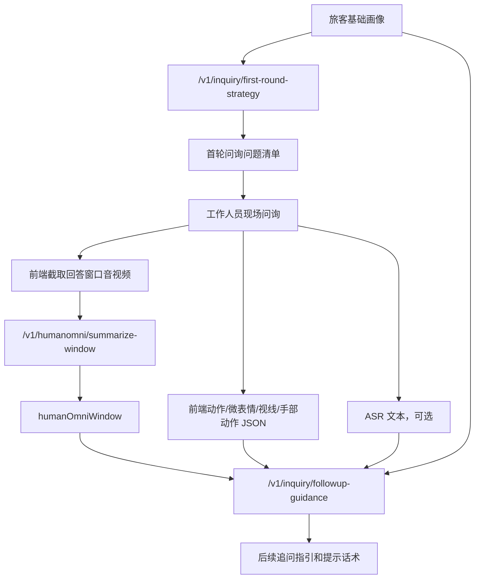

# AI-Service 接口对接文档

本文档用于前端、后端和 AI-Service 联调。当前 AI-Service 提供三个主要接口：

| 场景 | 接口 | 说明 |
| --- | --- | --- |
| HumanOmni 视频摘要 | `POST /v1/humanomni/summarize-window` | 上传 5-10 秒音视频片段，返回 HumanOmni 窗口摘要 |
| 首轮问询策略 | `POST /v1/inquiry/first-round-strategy` | 根据旅客基础画像生成首轮问题清单 |
| 后续追问指引 | `POST /v1/inquiry/followup-guidance` | 接收画像、问答历史、HumanOmni 摘要、动作 JSON 和可选 ASR 文本，生成追问建议 |

## 1. 推荐对接流程



说明：

- HumanOmni 只负责窗口级音视频摘要，不负责结构化动作识别。
- 动作、微表情、视线、手部动作等结构化数据由前端或独立动作识别模块生成，传入 `actionObservations`。
- ASR 当前不是 D.LLM 负责范围，但后续追问接口已经保留 `asr` 字段；未接入时可以不传，或传 `status: "not_connected"`。

## 2. HumanOmni 视频摘要接口

```http
POST /v1/humanomni/summarize-window
Content-Type: multipart/form-data
```

用途：上传某一轮回答对应的 5-10 秒音视频片段，由 AI-Service 调用 HumanOmni0.5 生成摘要。

### 2.1 表单字段

| 字段 | 类型 | 必填 | 说明 |
| --- | --- | --- | --- |
| `file` | file | 是 | 上传的视频或音频片段，建议 mp4 |
| `sessionId` | string | 是 | 问询会话 ID |
| `questionId` | string | 否 | 当前问题 ID |
| `windowId` | string | 否 | 当前窗口 ID，不传则服务端生成 |
| `modal` | string | 否 | `video`、`video_audio` 或 `audio`，默认 `video_audio` |
| `startSeconds` | number | 否 | 该窗口在原始问询时间线中的开始秒数 |
| `endSeconds` | number | 否 | 该窗口在原始问询时间线中的结束秒数 |
| `maxNewTokens` | number | 否 | HumanOmni 最大输出 token，默认 128 |
| `numFrames` | number | 否 | HumanOmni 视频采样帧数，不传则使用模型默认 |
| `instruct` | string | 否 | HumanOmni 摘要提示词，不传则使用默认摘要提示词 |

### 2.2 响应示例

```json
{
  "ok": true,
  "sessionId": "inq-001",
  "questionId": "q1",
  "windowId": "w1",
  "startSeconds": 18.0,
  "endSeconds": 23.0,
  "modal": "video_audio",
  "uploadedFile": {
    "filename": "answer-window.mp4",
    "storedPath": "D:/405project/ipra/apps/ai-service/uploads/humanomni-windows/inq-001-w1.mp4",
    "contentType": "video/mp4",
    "sizeBytes": 1024000
  },
  "humanOmni": {
    "modelName": "HumanOmni0.5",
    "rawSummary": "The person is speaking and appears slightly tense.",
    "elapsedSeconds": 13.5,
    "error": null
  },
  "humanOmniWindow": {
    "windowId": "w1",
    "questionId": "q1",
    "startSeconds": 18.0,
    "endSeconds": 23.0,
    "modal": "video_audio",
    "rawSummary": "The person is speaking and appears slightly tense.",
    "modelName": "HumanOmni0.5"
  }
}
```

`humanOmniWindow` 可以直接放入后续追问接口的 `humanOmniWindows` 数组中。

## 3. 首轮问询策略接口

```http
POST /v1/inquiry/first-round-strategy
Content-Type: application/json
```

用途：根据旅客基础画像和行程信息，生成首轮问询问题清单。

### 3.1 请求示例

```json
{
  "sessionId": "inq-001",
  "passengerProfile": {
    "passengerId": "pax-001",
    "name": "张三",
    "age": 28,
    "nationality": "中国",
    "occupation": "自由职业",
    "monthlyIncome": "不稳定"
  },
  "tripProfile": {
    "destination": "境外短期停留地",
    "purposeDeclared": "旅游",
    "stayDays": 21,
    "ticketType": "单程",
    "companions": [],
    "fundingSource": "本人承担"
  },
  "knownFacts": [
    "旅客无法提供稳定收入证明",
    "行程停留时间较长"
  ],
  "constraints": {
    "questionCount": 6,
    "tone": "中性、专业、非指控",
    "language": "zh-CN"
  }
}
```

### 3.2 响应核心字段

| 字段 | 说明 |
| --- | --- |
| `riskAssessment` | 首轮预评估摘要、风险等级和原因 |
| `strategy` | 首轮问询目标和关注方向 |
| `questions` | 问题清单，每个问题包含提问目的和预期核验信息 |
| `operatorNote` | 给工作人员的提示 |

## 4. 后续追问指引接口

```http
POST /v1/inquiry/followup-guidance
Content-Type: application/json
```

用途：接收多轮问答历史、HumanOmni 窗口摘要、前端动作 JSON 和可选 ASR 文本，生成后续追问指引和提示话术。

### 4.1 是否保留 ASR 字段

**保留了。** 当前接口中的 `asr` 字段是可选字段：

- ASR 未接入时：可以不传 `asr`，或传 `{"status": "not_connected", "text": ""}`。
- ASR 接入后：把同一回答窗口或同一轮回答的转写文本、分段和词级时间戳写入 `asr`。
- 业务 LLM 后续会把 `asr.text`、`humanOmniWindows` 和 `actionObservations` 一起作为追问判断输入。

注意：视频上传接口 `/v1/humanomni/summarize-window` 不接收 ASR 字段，它只负责视频传输和 HumanOmni 摘要。ASR 字段位于后续追问 JSON 接口 `/v1/inquiry/followup-guidance`。

### 4.2 请求示例

```json
{
  "sessionId": "inq-001",
  "roundNo": 2,
  "passengerProfile": {
    "passengerId": "pax-001",
    "name": "张三",
    "occupation": "自由职业",
    "monthlyIncome": "不稳定"
  },
  "tripProfile": {
    "destination": "境外短期停留地",
    "purposeDeclared": "旅游",
    "stayDays": 21,
    "ticketType": "单程"
  },
  "qaHistory": [
    {
      "questionId": "q1",
      "roundNo": 1,
      "question": "请您说明这次出境的主要目的。",
      "answerText": "我是去旅游，可能住二十多天，具体还要看朋友那边安排。",
      "answerStartSeconds": 12.4,
      "answerEndSeconds": 25.8
    }
  ],
  "humanOmniWindows": [
    {
      "windowId": "w1",
      "questionId": "q1",
      "startSeconds": 18.0,
      "endSeconds": 23.0,
      "modal": "video_audio",
      "rawSummary": "The person speaks with hesitation and shows a tense facial expression.",
      "modelName": "HumanOmni0.5"
    }
  ],
  "actionObservations": [
    {
      "observationId": "obs1",
      "type": "gaze_shift",
      "label": "视线偏移",
      "description": "回答停留时间时出现短暂视线偏移",
      "startSeconds": 18.0,
      "endSeconds": 20.5,
      "confidence": 0.68,
      "source": "frontend"
    },
    {
      "observationId": "obs2",
      "type": "hand_motion",
      "label": "手部动作增加",
      "description": "回答资金和朋友安排时手部动作明显增多",
      "startSeconds": 20.5,
      "endSeconds": 23.0,
      "confidence": 0.61,
      "source": "frontend"
    }
  ],
  "asr": {
    "status": "provided",
    "provider": "reserved-asr-provider",
    "model": "reserved-asr-model",
    "language": "zh-CN",
    "text": "我是去旅游，可能住二十多天，具体还要看朋友那边安排。",
    "segments": [
      {
        "startSeconds": 12.4,
        "endSeconds": 25.8,
        "text": "我是去旅游，可能住二十多天，具体还要看朋友那边安排。"
      }
    ],
    "words": []
  },
  "constraints": {
    "questionCount": 3,
    "tone": "中性、专业、非指控",
    "language": "zh-CN"
  }
}
```

### 4.3 关键字段说明

| 字段 | 说明 |
| --- | --- |
| `qaHistory` | 首轮或多轮问答历史，建议持续追加 |
| `humanOmniWindows` | HumanOmni 返回的窗口摘要数组 |
| `actionObservations` | 前端或动作识别模块输出的结构化动作 JSON |
| `asr` | 可选 ASR 转写结果，当前已预留 |
| `constraints.questionCount` | 希望返回的追问建议数量 |

### 4.4 响应核心字段

| 字段 | 说明 |
| --- | --- |
| `multimodalAssessment.summary` | 结合问答、HumanOmni 摘要、动作 JSON 和 ASR 文本后的综合摘要 |
| `multimodalAssessment.riskHints` | 候选异常提示，只作为追问参考 |
| `multimodalAssessment.evidence` | 参与判断的证据摘要 |
| `followupGuidance` | 后续追问建议和提示话术 |
| `warnings` | 风险提示，强调系统输出不直接构成结论 |

## 5. 本地联调命令

启动服务：

```powershell
cd D:\405project\ipra
& ".\apps\ai-service\.venv\Scripts\python.exe" -m uvicorn service:app --app-dir apps\ai-service\app --host 127.0.0.1 --port 9000
```

另开一个终端运行 smoke test：

```powershell
& ".\apps\ai-service\.venv\Scripts\python.exe" apps\ai-service\scripts\smoke_humanomni_summarize_window.py --base-url http://127.0.0.1:9000
& ".\apps\ai-service\.venv\Scripts\python.exe" apps\ai-service\scripts\smoke_first_round_strategy.py --base-url http://127.0.0.1:9000
& ".\apps\ai-service\.venv\Scripts\python.exe" apps\ai-service\scripts\smoke_followup_guidance.py --base-url http://127.0.0.1:9000
```
