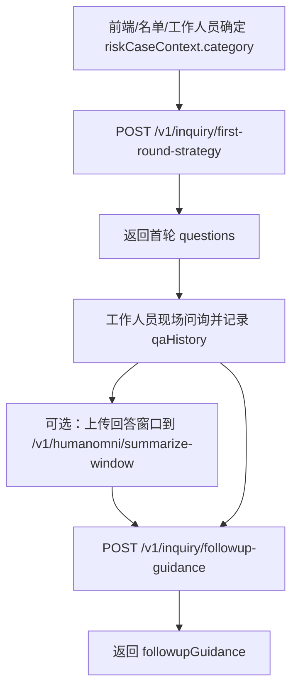

# 四类出境风险 LLM 问询规则与对接文档

## 1. 使用结论

AI-Service 对外接口保持不变。调用方只需要在首轮策略和后续追问请求中传入 `riskCaseContext.category`，服务端会自动选择对应风险类型的专门 prompt：

```text
base prompt + risk_cases/{category}.first_round.zh.md
base prompt + risk_cases/{category}.followup.zh.md
```

`category=unknown`、空字符串、缺失或非法值都会 fallback 到 `suspicious_purpose`。`riskCaseContext` 只表示辅助问询方向，不是风险结论；响应 JSON 不会新增 `riskCaseContext` 顶层字段。

## 2. 本地启动

本项目联调命令要求使用 PowerShell 7.x 及以上。

```powershell
cd D:\405project\ipra\apps\ai-service
$env:PYTHONPATH="app"
$env:BUSINESS_LLM_PROVIDER="openai_compatible"
$env:BUSINESS_LLM_BASE_URL="http://deepseek-server:8000/v1"
$env:BUSINESS_LLM_MODEL="deepseek-ai/DeepSeek-V3.2"
$env:BUSINESS_LLM_API_KEY="test-token"
.\.venv\Scripts\python.exe -m uvicorn service:app --app-dir app --host 127.0.0.1 --port 9000
```

健康检查：

```http
GET http://127.0.0.1:9000/health
```

可用的业务 LLM provider：

| Provider | 用途 |
| --- | --- |
| `openai_compatible` | 对接 DeepSeek/Qwen 等 OpenAI-compatible 服务，推荐联调真实效果时使用 |
| `transformers_local` | 使用本地 Transformers 模型 |
| `mock` | 仅用于接口 schema 联调；后续追问接口要求真实业务 LLM |

## 3. 推荐对接流程



对接要点：

- 首轮和追问都传同一个 `sessionId`。
- 首轮和追问都建议传同一个 `riskCaseContext.category`；如果工作人员中途改选风险类型，后续请求传新的 category 即可。
- `qaHistory` 应持续追加，不要只传最近一问，否则追问去重和上下文判断会变弱。
- HumanOmni 和 ASR 都是后续追问的辅助上下文；不接入时可以传空数组或不传。
- 动作、情绪、多模态观察只能作为追问参考，不能单独构成风险结论。

## 4. riskCaseContext 输入约定

```json
{
  "source": "watchlist",
  "category": "cross_border_gambling",
  "label": "跨境赌博",
  "reason": "高风险名单原因或工作人员选择原因",
  "riskTags": ["可选标签"],
  "officerNote": "可选现场备注"
}
```

字段说明：

| 字段 | 类型 | 必填 | 说明 |
| --- | --- | --- | --- |
| `source` | string | 否 | `watchlist`、`officer`、`none`；缺省按 `none` 处理 |
| `category` | string | 否 | 四类风险方向之一；缺失、`unknown`、空值或非法值 fallback 到 `suspicious_purpose` |
| `label` | string | 否 | 前端展示文案，如“跨境赌博”“跨境电诈”“非法务工”“出境目的存疑” |
| `reason` | string | 否 | 名单命中原因、工作人员选择原因或预评估说明 |
| `riskTags` | string[] | 否 | 辅助标签，只作为上下文 |
| `officerNote` | string | 否 | 工作人员备注，只作为上下文 |

四类按钮固定映射：

| 按钮文案 | category |
| --- | --- |
| 跨境赌博 | `cross_border_gambling` |
| 跨境电诈 | `cross_border_fraud` |
| 非法务工 | `illegal_work` |
| 出境目的存疑 | `suspicious_purpose` |

兼容旧请求：如果完全不传 `riskCaseContext`，AI-Service 会按 `suspicious_purpose` 处理。

## 5. 首轮问询策略接口

```http
POST /v1/inquiry/first-round-strategy
Content-Type: application/json
```

用途：根据旅客基础画像、行程信息、已知事实和 `riskCaseContext.category`，生成首轮问询问题清单。

### 5.1 请求示例

```json
{
  "sessionId": "inq-001",
  "passengerProfile": {
    "passengerId": "pax-001",
    "name": "张三",
    "age": 28,
    "gender": "男",
    "nationality": "中国",
    "occupation": "自由职业",
    "monthlyIncome": "不稳定",
    "travelHistory": ["2024 年短期出境一次"]
  },
  "tripProfile": {
    "destination": "境外短期停留地",
    "purposeDeclared": "旅游",
    "stayDays": 21,
    "ticketType": "单程",
    "returnTicketStatus": "未提供",
    "companions": [],
    "accommodation": "未明确",
    "fundingSource": "本人承担"
  },
  "knownFacts": [
    "旅客无法提供稳定收入证明",
    "行程停留时间较长"
  ],
  "riskCaseContext": {
    "source": "officer",
    "category": "illegal_work",
    "label": "非法务工",
    "reason": "工作人员认为签证目的、停留时长和职业收入情况需要进一步核验",
    "riskTags": ["停留时间较长", "材料链待核验"],
    "officerNote": "现场人工选择非法务工方向，仅作为辅助问询方向"
  },
  "constraints": {
    "questionCount": 6,
    "tone": "中性、专业、非指控",
    "language": "zh-CN"
  }
}
```

### 5.2 响应结构

```json
{
  "sessionId": "inq-001",
  "llm": {
    "provider": "openai_compatible",
    "model": "deepseek-ai/DeepSeek-V3.2"
  },
  "riskAssessment": {
    "level": "medium",
    "summary": "当前仅为非法务工方向的辅助问询线索，需要核验签证目的、停留安排和材料链。",
    "reasons": ["停留时间较长", "返程边界待核验"]
  },
  "strategy": {
    "goal": "通过中性问题核验申报目的、每日安排、材料来源和返程边界。",
    "focusAreas": ["签证目的-每日安排", "雇主/中介-岗位薪酬", "食宿费用-返程边界"]
  },
  "questions": [
    {
      "questionId": "q1",
      "priority": 1,
      "question": "请说明本次签证或通行条件对应的停留目的，以及境外期间每天的大致安排。",
      "purpose": "核验申报目的与实际安排是否一致。",
      "expectedEvidence": ["签证类型", "行程单", "住宿订单"]
    }
  ],
  "memoryReferences": [],
  "memoryUpdates": [],
  "operatorNote": "保持中性核验，不要将签证类型、收入或停留时长单独作为结论。"
}
```

说明：

- `llm`、`memoryReferences`、`memoryUpdates` 由服务端补齐。
- `questions[].expectedEvidence` 是工作人员应关注的证据或回答特征，不表示旅客必须立即提供全部材料。
- 首轮输出不会新增任何顶层字段。

## 6. 后续追问指引接口

```http
POST /v1/inquiry/followup-guidance
Content-Type: application/json
```

用途：结合画像、行程、同一风险类型、问答历史、HumanOmni 摘要、动作 JSON 和可选 ASR 文本，生成后续追问建议。

### 6.1 请求示例

```json
{
  "sessionId": "inq-001",
  "roundNo": 2,
  "passengerProfile": {
    "passengerId": "pax-001",
    "name": "张三",
    "occupation": "自由职业",
    "monthlyIncome": "不稳定"
  },
  "tripProfile": {
    "destination": "境外短期停留地",
    "purposeDeclared": "旅游",
    "stayDays": 21,
    "ticketType": "单程",
    "returnTicketStatus": "未提供"
  },
  "riskCaseContext": {
    "source": "officer",
    "category": "illegal_work",
    "label": "非法务工",
    "reason": "工作人员认为签证目的、停留时长和职业收入情况需要进一步核验",
    "officerNote": "沿用首轮人工选择方向"
  },
  "qaHistory": [
    {
      "questionId": "q1",
      "roundNo": 1,
      "question": "请您说明这次出境的主要目的。",
      "answerText": "我是去旅游，可能住二十多天，具体还要看朋友那边安排。",
      "answerStartSeconds": 12.4,
      "answerEndSeconds": 25.8
    }
  ],
  "humanOmniWindows": [
    {
      "windowId": "w1",
      "questionId": "q1",
      "startSeconds": 18.0,
      "endSeconds": 23.0,
      "modal": "video_audio",
      "rawSummary": "The person speaks with hesitation and shows a tense facial expression.",
      "modelName": "HumanOmni0.5"
    }
  ],
  "actionObservations": [
    {
      "observationId": "obs1",
      "type": "gaze_shift",
      "label": "视线偏移",
      "description": "回答停留时间时出现短暂视线偏移",
      "startSeconds": 18.0,
      "endSeconds": 20.5,
      "confidence": 0.68,
      "source": "frontend"
    }
  ],
  "asr": {
    "status": "provided",
    "provider": "reserved-asr-provider",
    "model": "reserved-asr-model",
    "language": "zh-CN",
    "text": "我是去旅游，可能住二十多天，具体还要看朋友那边安排。",
    "segments": [
      {
        "startSeconds": 12.4,
        "endSeconds": 25.8,
        "text": "我是去旅游，可能住二十多天，具体还要看朋友那边安排。"
      }
    ],
    "words": []
  },
  "constraints": {
    "questionCount": 3,
    "tone": "中性、专业、非指控",
    "language": "zh-CN"
  }
}
```

### 6.2 响应结构

```json
{
  "sessionId": "inq-001",
  "roundNo": 2,
  "llm": {
    "provider": "openai_compatible",
    "model": "deepseek-ai/DeepSeek-V3.2"
  },
  "multimodalAssessment": {
    "summary": "回答中提到由朋友安排，但住宿、费用和返程边界仍需补齐；视频和动作线索只能作为追问参考。",
    "riskHints": ["住宿安排来源待核验", "返程边界待核验"],
    "evidence": ["qaHistory: 旅客称具体看朋友安排", "actionObservations: 回答停留时间时出现短暂视线偏移"],
    "limitations": ["动作置信度有限，不能单独构成结论"]
  },
  "followupGuidance": [
    {
      "priority": 1,
      "question": "您刚才提到具体安排要看朋友那边，能否说明对方与您的关系，以及主要负责哪些事项？",
      "reason": "核验联系人关系和安排来源。",
      "operatorTip": "先复述确认，再追问对方身份和负责事项。",
      "focusArea": "联系人链"
    }
  ],
  "memoryReferences": [],
  "memoryUpdates": [],
  "operatorNote": "该方向来自工作人员人工判断，仅用于辅助问询。",
  "warnings": []
}
```

说明：

- `followupGuidance` 会按 `constraints.questionCount` 补齐或截断，并进行重复问题改写和去重。
- 已经明确回答且未发现矛盾的主题，不应原样重复问。
- 如果 ASR 缺失，可以不传 `asr`，或传 `{ "status": "not_connected", "text": "" }`。

## 7. HumanOmni 视频摘要接口

```http
POST /v1/humanomni/summarize-window
Content-Type: multipart/form-data
```

用途：上传某一轮回答对应的 5-10 秒音视频片段，由 AI-Service 调用 HumanOmni 生成窗口摘要。返回的 `humanOmniWindow` 可以直接放入后续追问接口的 `humanOmniWindows`。

表单字段：

| 字段 | 类型 | 必填 | 说明 |
| --- | --- | --- | --- |
| `file` | file | 是 | 上传的视频或音频片段，建议 MP4/H.264 |
| `sessionId` | string | 是 | 问询会话 ID |
| `questionId` | string | 否 | 当前问题 ID |
| `windowId` | string | 否 | 当前窗口 ID，不传则服务端生成 |
| `modal` | string | 否 | `video`、`video_audio` 或 `audio`，默认 `video_audio` |
| `startSeconds` | number | 否 | 窗口开始秒数 |
| `endSeconds` | number | 否 | 窗口结束秒数 |
| `maxNewTokens` | number | 否 | HumanOmni 最大输出 token，默认 128 |
| `numFrames` | number | 否 | HumanOmni 视频采样帧数 |
| `instruct` | string | 否 | HumanOmni 摘要提示词 |

响应中的 `humanOmniWindow` 示例：

```json
{
  "windowId": "w1",
  "questionId": "q1",
  "startSeconds": 18.0,
  "endSeconds": 23.0,
  "modal": "video_audio",
  "rawSummary": "The person is speaking and appears slightly tense.",
  "modelName": "HumanOmni0.5"
}
```

## 8. Prompt 文件结构

首轮和追问 prompt 已拆成“base prompt + 风险类型专门 prompt”的结构：

| 场景 | Base prompt | 风险类型 prompt |
| --- | --- | --- |
| 首轮策略 | `apps/ai-service/app/prompts/first_round_strategy.base.zh.md` | `apps/ai-service/app/prompts/risk_cases/{category}.first_round.zh.md` |
| 后续追问 | `apps/ai-service/app/prompts/followup_guidance.base.zh.md` | `apps/ai-service/app/prompts/risk_cases/{category}.followup.zh.md` |

当前 category 到文件映射：

| category | 首轮 prompt | 追问 prompt |
| --- | --- | --- |
| `cross_border_gambling` | `risk_cases/cross_border_gambling.first_round.zh.md` | `risk_cases/cross_border_gambling.followup.zh.md` |
| `cross_border_fraud` | `risk_cases/cross_border_fraud.first_round.zh.md` | `risk_cases/cross_border_fraud.followup.zh.md` |
| `illegal_work` | `risk_cases/illegal_work.first_round.zh.md` | `risk_cases/illegal_work.followup.zh.md` |
| `suspicious_purpose` | `risk_cases/suspicious_purpose.first_round.zh.md` | `risk_cases/suspicious_purpose.followup.zh.md` |

base prompt 只保留通用规则、JSON 输出约束、中性非指控要求、不得虚构证据、memoryContext 使用限制，以及动作/情绪不能单独构成风险结论等规则。每个 risk case prompt 单独维护该类型的核验目标、重点线索、推荐问法、禁止话术、expectedEvidence 关注点和追问策略。

## 9. 四类风险问询规则

### 跨境赌博

核验目标：

- 出境目的和到达后活动安排。
- 资金来源、借贷、代付和费用承担人。
- 同行人员、组织人、境外接待人。
- 住宿、停留周期和返程边界。

推荐问法：

- “请您按到达后的时间顺序说明第一天和第二天的具体安排。”
- “这次机票、住宿、境外活动和日常费用分别由谁承担？”
- “是否有人同行或在境外接待您，对方负责哪些安排？”

禁止：不得直接问“你是不是去赌博/参赌”，不得把目的地、资金异常、同行或住宿安排直接定性。

### 跨境电诈

核验目标：

- 招聘、邀约或培训来源。
- 境外联系人、接送和住宿安排。
- 手机、银行卡、电脑、账号和通讯软件用途。
- 工作或培训内容真实性。

推荐问法：

- “请您说明这次出境是谁邀请或联系的，对方通过什么渠道联系您。”
- “到达后是否有人接应或协助住宿交通，对方身份和联系方式来源是什么？”
- “这次携带的手机、银行卡、电脑、账号或通讯软件分别用于什么事项？”

禁止：不得直接问“你是不是去诈骗/参与电诈”，不得诱导旅客承认违法。

### 非法务工

核验目标：

- 签证或停留资格与实际目的是否一致。
- 境外雇主、中介、岗位和薪酬承诺。
- 合同、邀请函、培训通知等材料来源。
- 食宿安排、费用承担和返程边界。

推荐问法：

- “请说明本次签证或通行条件对应的停留目的，以及境外期间每天的大致安排。”
- “境外是否有单位、中介或个人为您安排固定事项，对方主要负责什么？”
- “这次安排是否涉及岗位、报酬、培训、试工或食宿承诺？”

禁止：不得直接问“你是不是去非法打工”，不得将旅游签、收入低或停留长直接定性。

### 出境目的存疑

核验目标：

- 申报目的与行程、资金、住宿、同行、返程、历史出入境之间的一致性。
- 时间线不清、材料缺口、联系人关系模糊、资金来源不匹配等缺口。

推荐问法：

- “请您先完整说明这次出境的主要目的，以及到达后最先要处理的事情。”
- “请按时间顺序说明预计停留几天、主要去哪些城市或地点、每天大致安排是什么。”
- “住宿、同行人员、境外联系人和返程安排目前分别确认到哪一步？”

禁止：不得直接质疑“你说的不真实”，不得以单一异常或情绪表现作为结论。

## 10. 联调与验收

运行 AI-Service 单测：

```powershell
cd D:\405project\ipra\apps\ai-service
$env:PYTHONPATH="app"
.\.venv\Scripts\python.exe -m unittest services.test_business_llm_client
```

真实模型 smoke test 建议：

- 用 `cross_border_gambling`、`cross_border_fraud`、`illegal_work`、`suspicious_purpose` 各调用一次首轮策略。
- 用同样四类 category 各调用一次后续追问。
- 额外测试 `category=unknown`、空值、缺失、非法值，确认都 fallback 到 `suspicious_purpose`。
- 检查 Qwen/DeepSeek 输出是否保持严格 JSON、无新增顶层字段、问法中性专业、没有直接指控。

## 11. 新增第五类风险

新增风险类型时按以下步骤处理：

1. 在前后端约定新的 `riskCaseContext.category` 值和显示文案。
2. 在 `apps/ai-service/app/services/business_llm_client.py` 的 `SUPPORTED_RISK_CASE_CATEGORIES` 中加入新 category，确认 prompt 文件映射生成规则适用。
3. 新增两份 prompt：`apps/ai-service/app/prompts/risk_cases/{category}.first_round.zh.md` 和 `apps/ai-service/app/prompts/risk_cases/{category}.followup.zh.md`。
4. 为首轮和追问补充单测，确认新 category 能拼接到对应 prompt；同时保留 unknown/非法值 fallback 到 `suspicious_purpose`。
5. 如有前端按钮、业务文档或操作手册，同步更新 category 映射说明。
