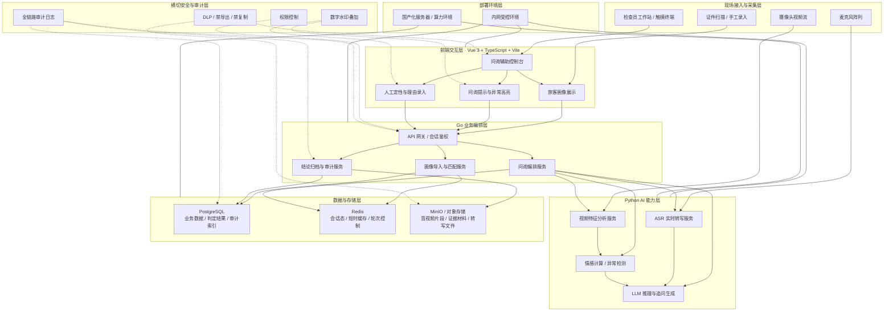
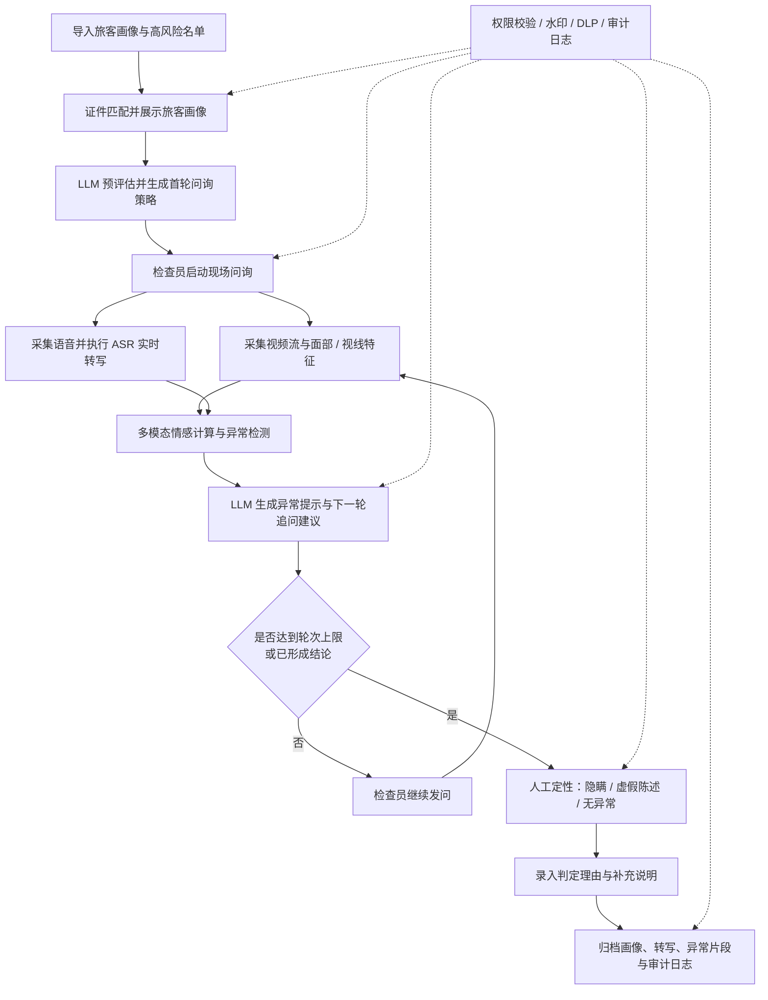
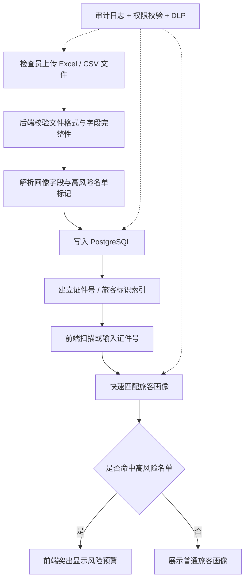
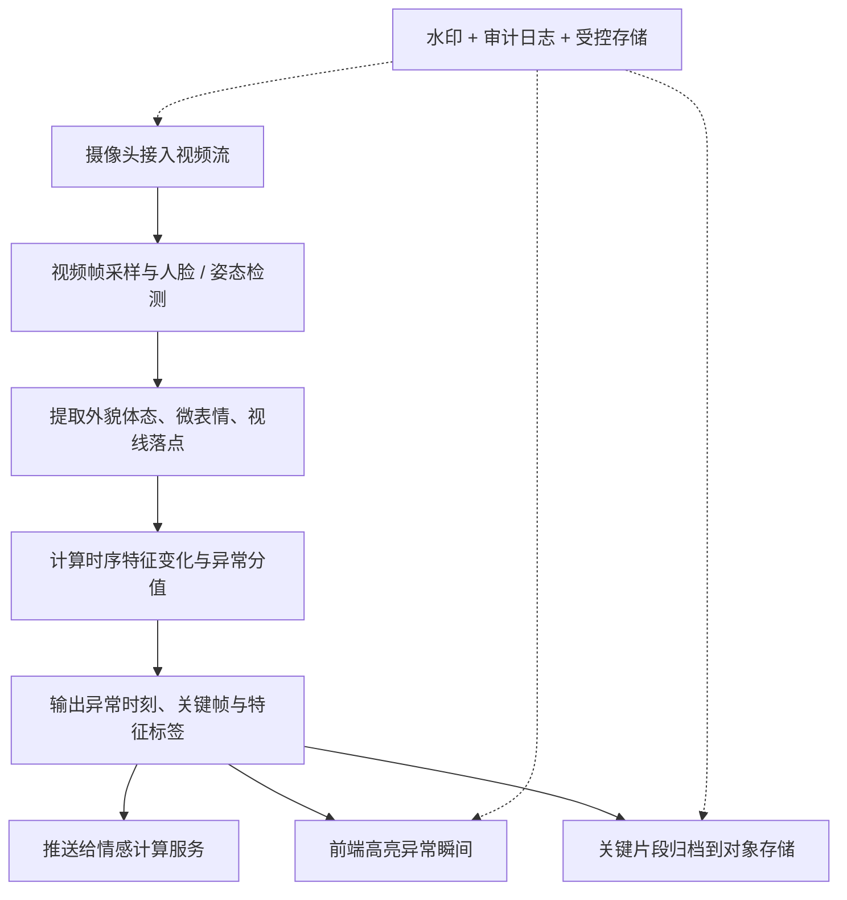
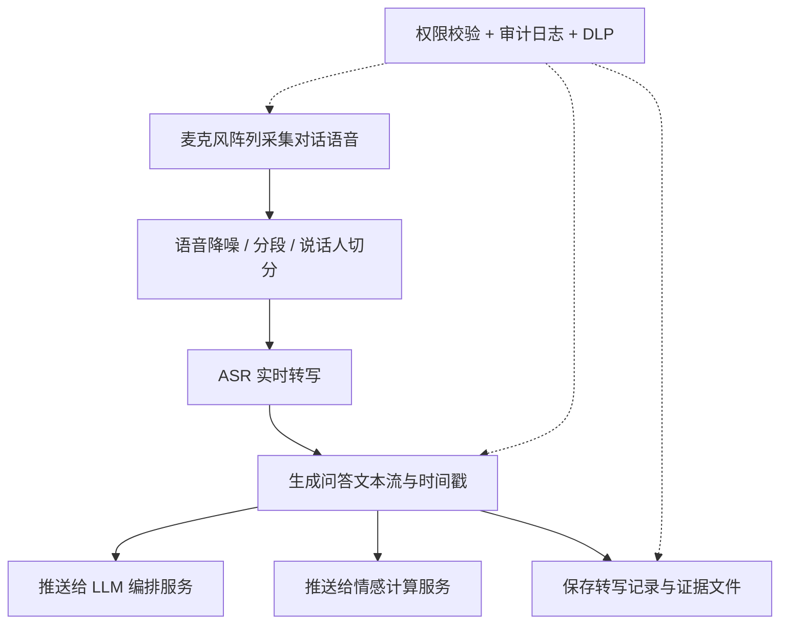
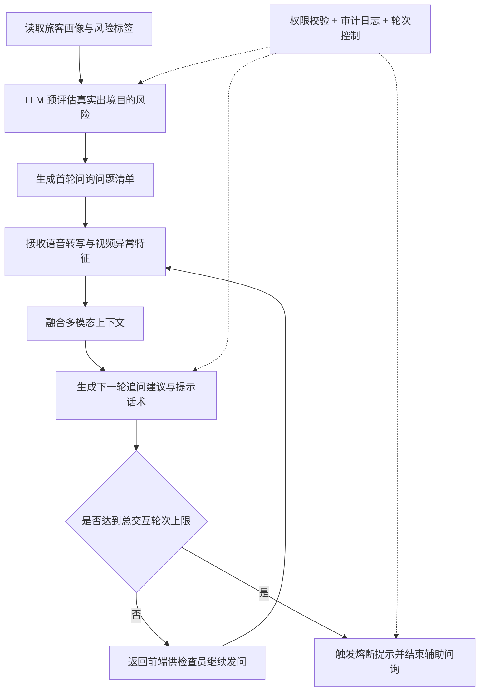
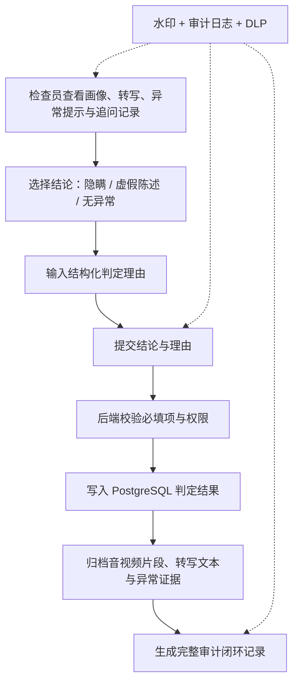

# 技术架构与流程设计

本文档基于《需求书》整理目标系统的技术架构与流程设计，用于统一项目对整体分层、关键模块、端到端业务闭环和安全审计落点的理解。

## 1. 文档定位与当前仓库现状

当前仓库仍处于前后端骨架阶段，不代表需求书中的完整系统已经实现：

- `apps/frontend` 为 Vue 3 + Vite 前端骨架，当前仅保留基础路由与页面壳层。
- `apps/backend` 为 Go 后端骨架，当前只有最小化启动入口。
- `docs/` 为 VitePress 文档站，承担需求书、人员分工和后续技术资料的沉淀。

因此，本文以下内容描述的是按需求书落地的**目标技术方案**，用于指导后续系统建设与模块拆分，而不是对当前代码现状的功能宣称。

## 2. 目标总体技术架构

目标系统采用“前端交互层 + Go 业务编排层 + Python AI 能力层 + 受控数据层 + 横切安全审计层”的分层架构，既满足现场问询实时性，也满足敏感数据受控和国产化部署要求。

### 2.1 总体技术架构图

### 2.2 分层说明

#### 前端交互层

- 提供现场问询辅助主界面，承载旅客画像、问询建议、异常提醒与判定录入。
- 对前端所有操作页面强制叠加数字水印。
- 对敏感数据交互施加 DLP 约束，不提供导出、复制和非授权分享能力。

#### Go 业务编排层

- 对外统一提供 API 网关、登录态校验和工作台会话管理。
- 负责画像导入、旅客匹配、问询流程编排、轮次熔断和结论归档。
- 作为前端与 AI 能力层之间的统一编排中枢，避免前端直连模型与底层存储。

#### Python AI 能力层

- ASR 服务负责实时语音识别与文本流输出。
- 视频分析服务负责外貌体态、微表情、视线等特征提取。
- 情感计算服务融合视频特征和文本语义，输出异常分值与关键时刻。
- LLM 服务负责预评估、首轮问询生成、追问策略和多轮闭环引导。

#### 数据与存储层

- PostgreSQL 存放旅客画像导入结果、问询过程结构化数据、判定结果与审计索引。
- Redis 负责临时会话状态、轮次计数、热点画像缓存与短时推理上下文。
- MinIO 或同类对象存储负责音视频片段、转写文件、异常截图与归档材料。

#### 横切安全与审计层

- 审计日志覆盖登录、查询、问询、判定、查看回放等全过程。
- DLP 约束覆盖前端页面、接口响应和存储访问三个层面。
- 水印贯穿前端页面、视频回放与输出内容。
- 权限控制确保角色、岗位、设备与访问范围一致。

## 3. 总体业务流程设计

总体业务流程围绕“画像预判 -> 现场问询 -> 多模态融合 -> 人工定性 -> 归档审计”展开，安全与审计能力全程伴随介入。

### 3.1 总体业务流程图

## 4. 模块级流程设计

### 4.1 旅客基础画像管理模块（2.1）

该模块负责完成离线数据接入、解析入库、风险名单标记和现场证件匹配，是后续大模型预评估的上下文基础。

### 4.2 视频特征采集模块（2.2.1）

该模块负责现场视频特征提取，并将异常片段与时间点提供给后续情感计算和前端异常高亮。

### 4.3 语音采集与实时转写模块（2.2.2）

该模块负责把现场对话语音持续转写为可供大模型与审计模块消费的文本流。

### 4.4 大模型智能辅助问询模块（2.3）

该模块是核心编排中枢，负责预评估、首轮策略、异常理解、追问生成和轮次熔断控制。

### 4.5 人机协同与结论定性模块（2.4）

该模块负责将模型辅助结果收束为可执行的人工业务判断，并形成完整归档闭环。

## 5. 横切安全与审计设计

需求书第 3 章中的非功能要求不应孤立看待，而应贯穿所有模块：

- `3.1` 审计日志：对登录、查询、问询、判定、日志查看、回放等操作自动留痕，并为 PostgreSQL 中的审计索引与对象存储中的证据文件建立可追溯关联。
- `3.2` DLP：从前端交互、接口响应和存储访问三个层面禁止非授权导出、复制和数据外流。
- `3.3` 数字水印：在前端页面、异常高亮画面、视频回放界面和任何输出内容中叠加操作员标识与时间戳。
- `3.4` 国产化部署：AI 推理服务、数据库与对象存储部署在受控内网与国产化算力环境中，避免跨境或外网依赖。
- `3.5` 数据来源受控：画像数据、高风险名单与训练数据集均默认由采购方提供，系统侧只负责受控接入、存储和使用。

## 6. 与当前仓库的演进关系

基于当前代码仓库，后续建议按以下方向演进：

1. 在 `apps/frontend` 中落地问询控制台、画像视图、异常高亮区和判定录入页。
2. 将 `apps/backend` 从示例入口扩展为 Go 业务服务，承接画像导入、问询编排、归档审计等核心能力。
3. 新增独立 AI 服务工程，承接 ASR、视频分析、情感计算与 LLM 编排。
4. 引入 PostgreSQL、Redis 与 MinIO 等基础设施，形成受控数据层。
5. 逐步把需求书中的业务条目映射为可交付的服务接口、状态流转和部署单元。

通过上述演进，当前仓库可以从“前后端骨架 + 文档站”逐步过渡为满足需求书目标的智能旅客风险评估与辅助问询系统。
